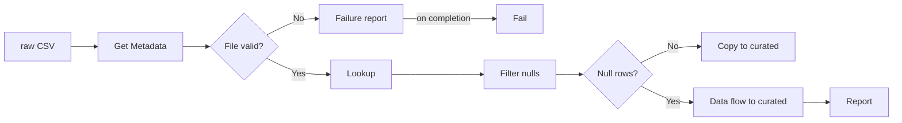

# adf-ogk-learn
## About

### A portfolio project: 
 - Azure Data Factory pipeline built from scratch.
 - Version-controlled in Git, with data quality checks, automatic cleansing and reporting.

### What this demonstrates
- Data quality gating:
   - invalid files stop the run;
   - bad rows are removed and reported.
- Failure handling:
   - failure is broadcast
   - error code and a report.
- Testing as evidence: a byte-for-byte comparison of two writers, and a failure path tested by breaking it.
- Cost control: budget alert, clusters only when needed, design trade-offs recorded.
- Git workflow: feature branch and pull request into `main`.

### Execution Steps:
- A CSV is uploaded manually to the `raw` container in Azure Blob Storage.
- The pipeline checks the file exists, isn't empty and has 17 columns; if not, it writes a failure report and stops.
- The pipeline reads every row and checks for rows with an empty `Vehicle_ID`.
- Clean file: it is copied to the `curated` container.
- Null rows found: a data flow removes them and writes the clean file to `curated`,
  then a JSON report of what was found and done is written to the `reports` container.

Design choices and trade-offs are recorded in [docs/decisions.md](docs/decisions.md).
  
## Naming conventions

- Linked services are named with prefix `ls_`.
-  Containers are directly named `raw`, `curated` and `reports`.
- Pipelines are named with prefix `pl_`.
- Pipeline activities are named with prefix `act_`.
  - Single `act_` prefix for all activity types;
  - revisit if names become ambiguous as the pipeline grows.
- Datasets are named with prefix `ds_`.
- Triggers are named with prefix `trg_`.
- Data flows are named with prefix `df_`.
  - Streams inside a data flow allow letters and numbers only, so they use camelCase with a short prefix: `src`, `flt`, `snk`.

## Components

### Pipeline

- `pl_copy_fleet_vehicles` validates the source file, then checks its rows before loading:
  1. `act_get_source_metadata` reads the file's properties: exists, size, column count.
  2. `act_check_metadata_conditions` stops the run if the file is missing, empty, or doesn't have 17 columns:
     `act_create_failure_report` writes a report to `reports`, then `act_fail_invalid_source` fails the run with error code `SOURCE_FILE_INVALID`.
  3. `act_lookup_fleet_source` reads every row of the file in `raw`.
  4. `act_filter_nulls` keeps rows where `Vehicle_ID` is empty.
  5. `act_if_null_rows_found` branches on whether any were found.
     - **False (clean file):** `act_copy_fleet_master` copies the file to `curated`.
     - **True (defects found):** `act_cleanse_fleet_vehicles` runs the data flow, then `act_create_report` writes a JSON report to `reports/<run_id>.json`.
       
- File names are pipeline parameters, supplied at run time:
  - `source_file`, default `Vehicle_Master.csv`
  - `sink_file`, default `vehicles_curated.csv`

- The source file was uploaded manually.

### Data flow

- `df_cleanse_fleet_vehicles`:
  1. `srcFleetVehicles` reads the source file. Schema drift is off and schema validation is on, so a file whose columns differ from the expected 17 fails the run.
  2. `fltValidVehicleIds` keeps rows where `Vehicle_ID` is not null.
  3. `snkFleetVehicles` writes a single file, `vehicles_curated.csv`, to `curated`.

- Verified in a debug run: 56 rows read, 1 flagged, 55 written.

### Trigger

- `trg_copy_fleet_vehicles` runs `pl_copy_fleet_vehicles` every 3 hours (South Africa Standard Time), passing the default file names.

- Currently **stopped**. It was started once to verify a scheduled run (56 rows in, 56 out), then stopped to avoid cost.

### Report

- Written by a Web activity calling Blob Storage directly, authenticated with the factory's managed identity (write access to `reports` only).
- Runs only after the data flow succeeds, so its `action` field reflects work actually done.
- Contains: source file, run ID, run time (UTC), the rule applied, the action taken, rows checked, rows flagged, and the flagged rows themselves.

### Known limitations

- Two writers to `curated`: the copy activity (clean files) and the data flow (files with defects).
- A byte-for-byte comparison found two differences:
   - line endings (fixed by setting the curated dataset's row delimiter to `\n`)
   - header quoting (the data flow quotes the header; the copy activity cannot).
   - Data rows are identical.
- **Fixed output name in the data flow:** the data flow always writes `vehicles_curated.csv`. The `sink_file` parameter only affects the copy branch.
- **No report on cleanse failure:** if the data flow fails, the report does not run.
- **Renamed columns on the clean path:** the guard checks the column count, not the names. A file with 17 renamed columns passes the guard; only the data flow's schema validation catches it, and that runs only when null rows are found.
- **Not yet checked:** a file with a header and no rows, and the same file arriving twice.

### History: the defect that started it

- A blank trailing row in the source export (56 rows read against 55 vehicles) was found by comparing run counts with the source.
- Three mitigations were considered:
  1. Mapping data flow with a Filter step. **Built.**
  2. Validation in the pipeline (Lookup, Filter, If Condition) with a report. **Built.** Get Metadata was ruled out for row checks; it's used for file-level checks.
  3. Database sink filtered in SQL. **Planned.**

## Cost Management

- This repo uses the $200 Azure free trial credit, which ends 30 days after 29 September 2026.
- Budget alert created at $10/month.
- Clean files use the copy activity (no Spark cluster). Only files with defects start a data flow cluster.
- Data flow debug is switched on only while testing.
