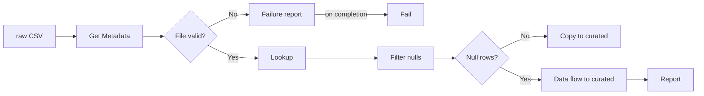
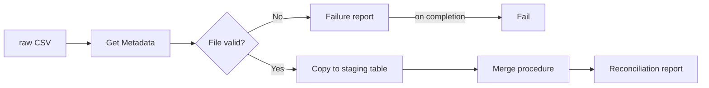

# adf-ogk-learn
## About

### A portfolio project: 
 - Azure Data Factory pipelines built from scratch.
 - Version-controlled in Git, with data quality checks, automatic cleansing and reporting.
 - Two pipelines from the same source file: file to file, and file to Azure SQL with a staged `MERGE` and a reconciliation report.

**`pl_copy_fleet_vehicles`** (file to file)

**`pl_copy_fleet_vehicles_tosql`** (file to Azure SQL)

### Walkthrough
A document for functional knowledge in [docs/walkthrough.md](docs/walkthrough.md)

### What this demonstrates
- Data quality gating:
   - invalid files stop the run;
   - bad rows are removed and reported.
- Failure handling:
   - failure is broadcast
   - error code and a report.
- Testing as evidence: a byte-for-byte comparison of two writers, and a failure path tested by breaking it.
- Cost control: budget alert, clusters only when needed, design trade-offs recorded.
- Git workflow: feature branch and pull request into `main`.
- SQL loading: a text staging table, a typed target with named constraints, and a `MERGE` in a stored procedure that is safe to rerun.
- Reconciliation: every run reports rows read, staged, rejected and merged, and the numbers add up.
- Database security: the factory connects with its managed identity. No passwords or connection strings are stored, and it holds only the permissions the load needs.
- Profiling before constraints: value lists and ranges were taken from the source file before any `CHECK` was written.

### Execution Steps:
- A CSV is uploaded manually to the `raw` container in Azure Blob Storage.
- The pipeline checks the file exists, isn't empty and has 17 columns; if not, it writes a failure report and stops.
- The pipeline reads every row and checks for rows with an empty `Vehicle_ID`.
- Clean file: it is copied to the `curated` container.
- Null rows found: a data flow removes them and writes the clean file to `curated`,
  then a JSON report of what was found and done is written to the `reports` container.

### Execution Steps (SQL path):
- The same CSV in `raw` is the source.
- The pipeline runs the same file checks; an invalid file writes a failure report and stops.
- Every row is copied as text into the staging table `stg.fleet_vehicles`, which is emptied first.
- A stored procedure merges staging into `dbo.fleet_vehicles`: values are converted to their types, rows with an empty `Vehicle_ID` are rejected, existing vehicles are updated and new ones inserted. Nothing is deleted from the target.
- The procedure returns its counts, and a JSON reconciliation report is written to the `reports` container.

Design choices and trade-offs are recorded in [docs/decisions.md](docs/decisions.md).
  
## Naming conventions

- Linked services are named with prefix `ls_`.
-  Containers are directly named `raw`, `curated` and `reports`.
- Pipelines are named with prefix `pl_`.
- Pipeline activities are named with prefix `act_`.
  - Single `act_` prefix for all activity types;
  - revisit if names become ambiguous as the pipeline grows.
- Datasets are named with prefix `ds_`.
- Triggers are named with prefix `trg_`.
- Data flows are named with prefix `df_`.
  - Streams inside a data flow allow letters and numbers only, so they use camelCase with a short prefix: `src`, `flt`, `snk`.
- Database objects use snake_case.
  - Schemas: `stg` for staging, `dbo` for the target.
  - Stored procedures are named with prefix `usp_`.
  - Constraints are named with a type prefix and the table name: `PK_`, `UQ_`, `CK_`, `DF_`.
- SQL scripts in `sql/` are numbered in the order they run: `01_`, `02_`, `03_`. Checks are `99_`.

## Components

### Pipeline

- `pl_copy_fleet_vehicles` validates the source file, then checks its rows before loading:
  1. `act_get_source_metadata` reads the file's properties: exists, size, column count.
  2. `act_check_metadata_conditions` stops the run if the file is missing, empty, or doesn't have 17 columns:
     `act_create_failure_report` writes a report to `reports`, then `act_fail_invalid_source` fails the run with error code `SOURCE_FILE_INVALID`.
  3. `act_lookup_fleet_source` reads every row of the file in `raw`.
  4. `act_filter_nulls` keeps rows where `Vehicle_ID` is empty.
  5. `act_if_null_rows_found` branches on whether any were found.
     - **False (clean file):** `act_copy_fleet_master` copies the file to `curated`.
     - **True (defects found):** `act_cleanse_fleet_vehicles` runs the data flow, then `act_create_report` writes a JSON report to `reports/<run_id>.json`.
       
- File names are pipeline parameters, supplied at run time:
  - `source_file`, default `Vehicle_Master.csv`
  - `sink_file`, default `vehicles_curated.csv`

- The source file was uploaded manually.

- `pl_copy_fleet_vehicles_tosql` validates the source file, then loads it into Azure SQL:
  1. `act_get_source_metadata` and `act_check_metadata_conditions` are the same guard as above.
  2. `act_copy_fleet_master_tosql` copies every row of the file into `stg.fleet_vehicles`.
     - A pre-copy script empties the staging table, so a rerun does not stack rows.
     - The 17 columns are mapped by name.
  3. `act_merge_fleet_vehicles` is a Lookup that runs the stored procedure `dbo.usp_merge_fleet_vehicles` and reads the one row it returns: `staged_rows`, `rejected_blank_key`, `merged_rows`.
  4. `act_create_report` writes a JSON reconciliation report to `reports/<run_id>.json`.

- One parameter: `source_file`, default `Vehicle_Master.csv`.
- The copy and the Lookup retry 3 times, 30 seconds apart, because the database pauses when idle.
- **Verified** 56 rows read, 56 staged, 1 rejected, 55 merged, in both runs:
  - triggered run `aded181f-2d4a-4002-8ee6-2293f350cf09` on the published factory (4 October 2026)
  - debug run `579f934c-bfbf-4f05-87b2-f7fafd2a00e6` (3 October 2026)
- Loading the same file twice does not duplicate rows (verified: second run, 55 updated, 0 inserted).
  
### Data flow

- `df_cleanse_fleet_vehicles`:
  1. `srcFleetVehicles` reads the source file. Schema drift is off and schema validation is on, so a file whose columns differ from the expected 17 fails the run.
  2. `fltValidVehicleIds` keeps rows where `Vehicle_ID` is not null.
  3. `snkFleetVehicles` writes a single file, `vehicles_curated.csv`, to `curated`.

- Verified in a debug run: 56 rows read, 1 flagged, 55 written.

### Trigger

- `trg_copy_fleet_vehicles` runs `pl_copy_fleet_vehicles` every 3 hours (South Africa Standard Time), passing the default file names.

- Currently **stopped**. It was started once to verify a scheduled run (56 rows in, 56 out), then stopped to avoid cost.

### Database

- Azure SQL Database `sql-db-ogk-fleet` on server `sql-ogk-adf-learn`, South Africa North, free offer, serverless.
- Linked service `ls_ogk_sql` connects with the factory's system-assigned managed identity. Dataset `ds_fleet_vehicles_stg` points at the staging table.
- `stg.fleet_vehicles`: 17 nullable text columns with the file's column names and no constraints. Every row in the file lands here.
- `dbo.fleet_vehicles`: typed columns, primary key on `Vehicle_ID`, unique `Registration_No`, `CHECK` constraints on fuel type, status, driver flag and both cost columns, and two audit columns (`Created_At_UTC`, `Updated_At_UTC`).
- `dbo.usp_merge_fleet_vehicles`: counts staging, runs the `MERGE`, returns the counts.
- The scripts are in [sql/](sql/) and run in number order on an empty database:
  - `01_schema_and_tables.sql`: the `stg` schema and both tables.
  - `02_security.sql`: the factory's database user and roles.
  - `03_merge_fleet_vehicles.sql`: the stored procedure and its `EXECUTE` grant.
  - `99_checks.sql`: verification queries with their expected results.

### Report

- Written by a Web activity calling Blob Storage directly, authenticated with the factory's managed identity (write access to `reports` only).
- Runs only after the data flow succeeds, so its `action` field reflects work actually done.
- Contains: source file, run ID, run time (UTC), the rule applied, the action taken, rows checked, rows flagged, and the flagged rows themselves.
- The SQL pipeline writes the same kind of report after the merge succeeds. It contains: source file, run ID, run time (UTC), the rule, the action, `rows_read` and `rows_copied` from the copy activity, and `staged_rows`, `rejected_blank_key` and `merged_rows` from the stored procedure.
  - Reconciliation: `rows_read` = `rows_copied` = `staged_rows`, and `staged_rows` = `rejected_blank_key` + `merged_rows`.

### Known limitations

- Two writers to `curated`: the copy activity (clean files) and the data flow (files with defects).
- A byte-for-byte comparison found two differences:
   - line endings (fixed by setting the curated dataset's row delimiter to `\n`)
   - header quoting (the data flow quotes the header; the copy activity cannot).
   - Data rows are identical.
- **Fixed output name in the data flow:** the data flow always writes `vehicles_curated.csv`. The `sink_file` parameter only affects the copy branch.
- **No report on cleanse failure:** if the data flow fails, the report does not run.
- **Renamed columns** stop the run only through side effects (the guard checks the column count, not the names):
   - the Filter, if `Vehicle_ID` is renamed;
   - the copy's column mapping;
   - data flow schema validation.
   - None write a report or use `SOURCE_FILE_INVALID`. See [tests/README.md](tests/README.md).
- **Header-only files pass:** a file with a header and no rows passes the guard and lands as an empty file in `curated` (test 04).
- **Not yet checked:** the same file arriving twice.

SQL path:
- **No schedule:** `pl_copy_fleet_vehicles_tosql` is published and runs on demand. It has no schedule trigger.
- **Retry path not yet exercised:** no run has started while the database was paused, so the 3 retries on the copy are untested.
- **Scripts are applied by hand:** the files in `sql/` were run in the query editor. There is no automated database deployment.
- **Only blank keys are counted as rejects:** a value that cannot be converted becomes NULL, and the target's `NOT NULL` constraint then fails the whole merge. Not yet tested. Reject logging per row is planned.
- **No report when the load fails:** the reconciliation report runs only after the merge succeeds.
- **Every matched row is updated on every run,** so `Updated_At_UTC` records the last load, whether or not the values changed.
- **Vehicles missing from a file are kept and not counted.**
- **Test fixtures 01 to 08 have not been run against this pipeline.** It has been run with the real source file only.
- **Staging holds the latest file only.** It is emptied before each load.

### History: the defect that started it

- A blank trailing row in the source export (56 rows read against 55 vehicles) was found by comparing run counts with the source.
- Three mitigations were considered:
  1. Mapping data flow with a Filter step. **Built.**
  2. Validation in the pipeline (Lookup, Filter, If Condition) with a report. **Built.** Get Metadata was ruled out for row checks; it's used for file-level checks.
  3. Database sink filtered in SQL. **Built** (`pl_copy_fleet_vehicles_tosql`): the blank row lands in staging and is rejected and counted by the stored procedure.

## Cost Management

- This repo uses the $200 Azure free trial credit, which ends 30 days after 29 September 2026.
- Budget alert created at $10/month.
- Clean files use the copy activity (no Spark cluster). Only files with defects start a data flow cluster.
- Data flow debug is switched on only while testing.
- The database uses the Azure SQL free offer (100,000 vCore seconds and 32 GB a month). Overage billing is disabled, so the database pauses when the free amount is used up.
- The database is serverless and pauses when idle.
- One copy run to SQL bills 0.0667 DIU-hours: 4 DIUs for the one-minute minimum (from the activity output).
  
