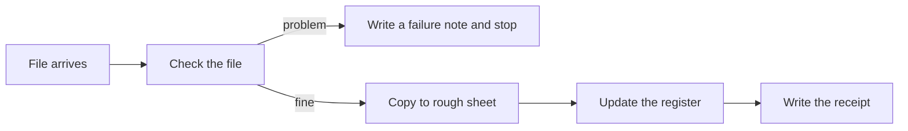

# How the pipeline works, in plain words

Audience: Functional / Non-IT interested parties. This document explains this project without code references.
Technical detail is in the [README](../README.md) and [decisions.md](decisions.md).

## In one sentence

A list of fleet vehicles arrives as a file, the pipeline checks it, loads it into a database,
and writes a short receipt saying exactly how many rows went where.

## The everyday version

Think of a school office at the start of term.

1. A class list arrives in the **inbox tray**.
2. The secretary **checks the page**: is it there, is it blank, does it have the right columns?
   If something is wrong, she writes a note saying what and stops.
3. She copies every line onto a **rough sheet**, exactly as written, mistakes and all.
4. From the rough sheet she updates the **official register**: new pupils are added, existing
   pupils are updated, and a line with no name is left out. Nobody is ever rubbed out of the
   register just because they are missing from today's list.
5. She writes a **receipt**: 56 lines received, 1 left out, 55 entered.

The pipeline is that secretary. The secretary may have to deal with last-minute emergencies. The pipeline never does.

## The same steps with their real names

| Step | Concept | Artefact | Location |
|---|---|---|---|
| 1 | The file sits in the inbox tray | `Vehicle_Master.csv` | in the `raw` storage container |
| 2 | Check the page before using it | `act_get_source_metadata` and `act_check_metadata_conditions` | in the pipeline root |
| 3 | Copy every line to the rough sheet | `act_copy_fleet_master_tosql` writes to the table `stg.fleet_vehicles` | in the pipeline root |
| 4 | Update the official register | `act_merge_fleet_vehicles` runs the procedure `dbo.usp_merge_fleet_vehicles`, which updates `dbo.fleet_vehicles` | stored procedure lives in the database |
| 5 | Write the receipt | `act_create_report` | in the pipeline root; the receipt file is saved in the `reports` container |

The whole thing is one pipeline called `pl_copy_fleet_vehicles_tosql`, built in Azure Data Factory.

## What happened on a real run

Run `579f934c-bfbf-4f05-87b2-f7fafd2a00e6`, 3 October 2026.

| Count | Number | Meaning |
|---|---|---|
| Rows read from the file | 56 | Everything in the file |
| Rows on the rough sheet | 56 | Nothing was lost on the way in |
| Rows left out | 1 | A blank line at the end of the file |
| Rows entered in the register | 55 | The 55 real vehicles |

56 = 1 + 55. Every row is accounted for. That check is called **reconciliation**, and the
pipeline does it by itself on every run.

## What it does when something is wrong

| Problem | What the pipeline does |
|---|---|
| The file is missing or empty | Writes a failure note and stops. Nothing is loaded. |
| The file has the wrong number of columns | Same: failure note, stop. |
| A row has no vehicle ID | Leaves it out of the register and counts it on the receipt. |
| The same file is loaded twice | Nothing is duplicated. The second run updates the same 55 vehicles. |
| A vehicle is missing from today's file | It stays in the register. The pipeline never deletes. |

## Questions people ask

**Why copy to a rough sheet first? Why not go straight to the register?**
So that nothing is rejected before it has been seen. Every line lands on the rough sheet,
good or bad. Then the pipeline can count what it left out. Today it counts rows with no vehicle ID; reporting other kinds of bad row is planned.

**Why does the register have stricter rules than the rough sheet?**
The rough sheet accepts anything as plain text. The register only accepts real dates, real
numbers and known values, for example a fuel type of Petrol or Diesel. Bad data is stopped
at the door of the register.

**Why not delete vehicles that have left the fleet?**
A vehicle has a cost and service history that should be kept. Vehicles that are retired stay
in the list with the status "Decommissioned".

**Is the real data in this repo?**
No. The real file stays in private storage. The repo holds the pipeline, the database
scripts, and invented test files.

## Words you will hear

| Word | Meaning |
|---|---|
| Pipeline | A fixed sequence of steps that moves and checks data |
| Activity | One step in the pipeline |
| Staging | The rough sheet: a holding table that accepts everything |
| Target | The official register: the table people actually use |
| Merge | Add what is new, update what already exists |
| Reconciliation | Proving the counts add up from start to finish |
| Run ID | The reference number of one run, used to find its receipt |
